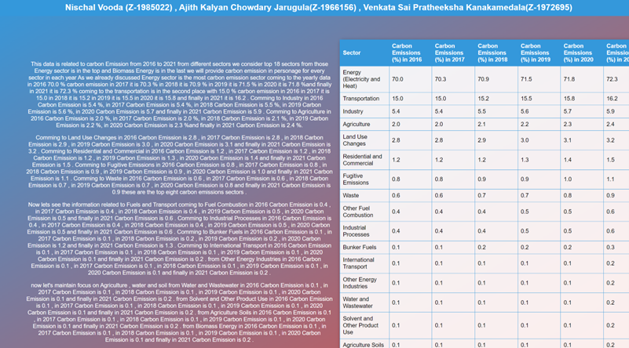

# Bridging-Text-and-Tables-for-Enhanced-Data-Understanding-on-the-Web

<!-- Website Description -->
We've designed a webpage with two sections. On the left, we display the raw text, while on the right, we present the data in a table format. Sometimes, reading text provides valuable insights, and other times, comparing data is more efficient using tables. By placing the text and table side by side, we eliminate the need to constantly switch between the two. Additionally, we've implemented interactive features using JavaScript. When a user hovers over a particular section of the text, it highlights the corresponding cell in the table. This feature saves users a significant amount of time, as they no longer need to manually search for information in the table. Similarly, users can hover their mouse cursor anywhere on the table to quickly access relevant information from the text. This approach enables users to find related information effectively and save time. We've adhered to good software engineering practices, including code organization and comments, and have separated HTML, CSS, and JavaScript into distinct files.

<!-- Website Deployment -->
To make our webpage easily accessible, we've deployed it on the Google Firebase hosting platform. You can access the website using the following secure URL: [https://hci-project-1-64e08.web.app/](https://hci-project-1-64e08.web.app/). This URL comes with an SSL certificate, ensuring that the website is secure through the use of the HTTPS protocol. We've followed best practices in software engineering by maintaining code organization and including necessary comments. If the URL does not function as expected, please open the `index.html` file in a web browser to view the implementation.

**Note:** Please Ctrl+ click on the link to access the website [https://hci-project-1-64e08.web.app/](https://hci-project-1-64e08.web.app/).

<!-- Website Images -->
**Website with white text**

**Website with Black text**

